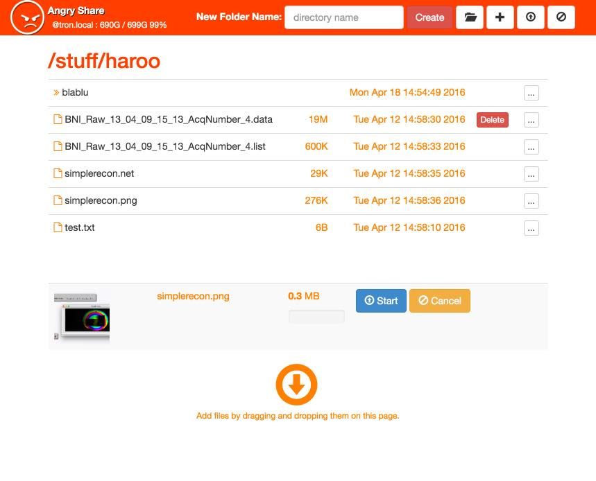
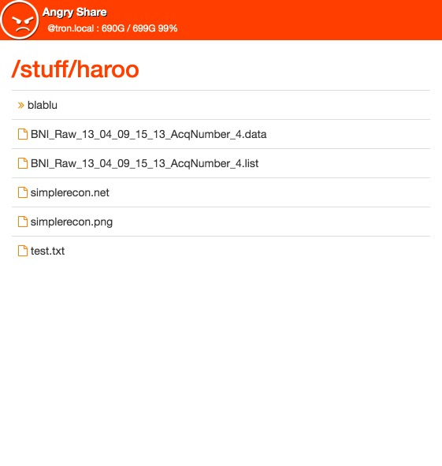

# ANGRY SHARE :@

Angry Share is a simple, minimalistic, web based file server.  It's targeted
towards file sharing within a lab/office environment where resources are
constantly changing and spinning up ad hoc data storage on the fly is a common 
need.  Since this server offers no security, there is very little
configuration (its assumed that any security would be provided by your
company firewall).  Angry Share is intended to work alongside an internal wiki,
code revision system, or intra-office email allowing collogues to share large
data sets with minimal impact on these other systems.

## Features

* No Security, No Users, No Social Media, No Picture Albums, No Databases, JUST
  FILE SHARING!
* Easy Setup
* Drag'n Drop File Upload
* Path-Based Directory Navigation
* Obvious File URLs that Mirror the Navigation
* All Functionality on a Single Page

## Built On

* [Flask](http://flask.pocoo.org/)
* [Bootstrap](http://getbootstrap.com/)
* [jQuery](https://jquery.com/)
* [DropZoneJS](http://www.dropzonejs.com/)
* [Python 3](https://www.python.org/)

## Screen Shots

